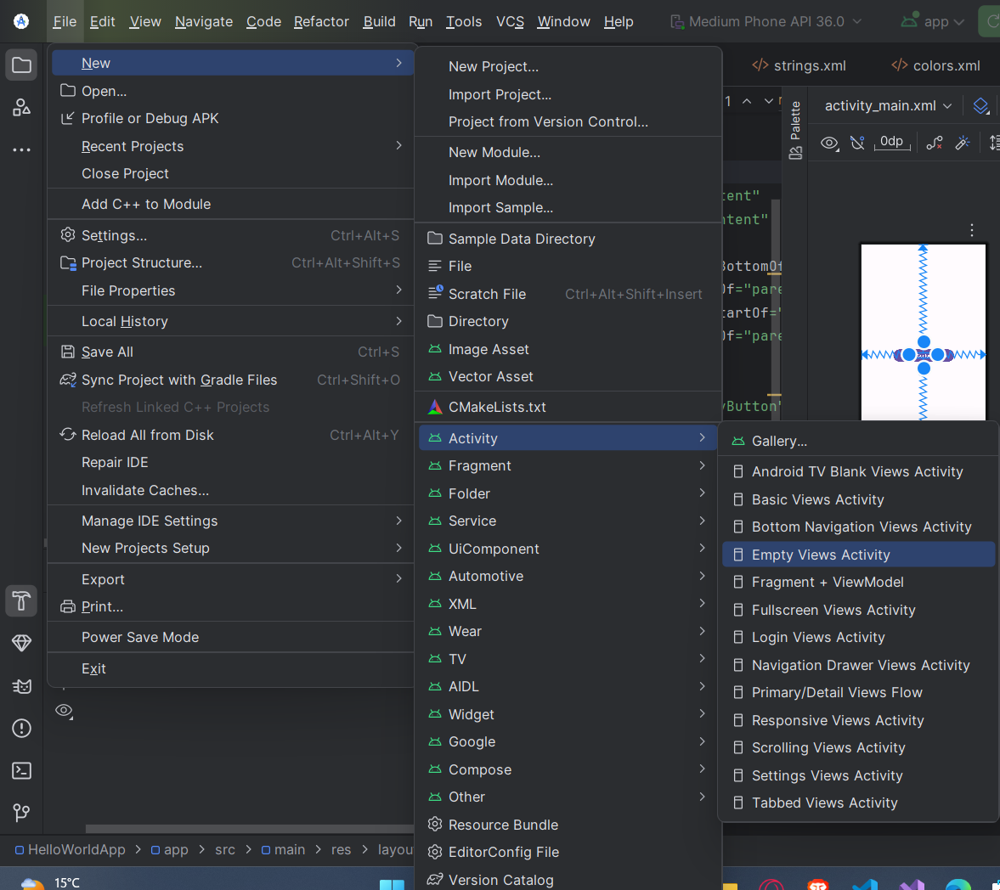

# Navigate to Activity

## 1. Make a new activity

First, make a new activity by either right-clicking on `com.example.projectname` and selecting `New > Activity` or by going to `File > New > Activity` and selecting `Empty Activity`.




choose a name for the Activity. The convention for naming the Activity Name is using `UpperCamelCase` with the word _**Activity**_ at the end. 
<br>
- For example: `ContactActivity`,
<br>
<br>

and for the Layout Name, use `lower_snake_case` with the word _**activity**_ at the start. 
<br>
- For example: `activity_contact`,
<br>

## 2. Making a button to navigate to the activity

Make a Button with an id to navigate to the new activity.

for example:
```xml
<Button
    android:id="@+id/switchActivityButton"
    android:layout_width="wrap_content"
    android:layout_height="wrap_content"
    android:text="Go To Contact Activity"
    app:layout_constraintLeft_toLeftOf="parent"
    app:layout_constraintRight_toRightOf="parent"
    app:layout_constraintBottom_toBottomOf="parent"
    app:layout_constraintTop_toTopOf="parent"/>
```


## 3. Navigate to the activity
inside the activity where the button is located, add the following code:

```kotlin
val switchActivityButton = findViewById<Button>(R.id.switchActivityButton);

switchActivityButton.setOnClickListener {
    val startActivityIntent = Intent(
        this,
        ContactActivity::class.java
    )
    startActivity(startActivityIntent)
}
```

this will navigate to the new activity.

if you want to pass data to the new activity, you can use the `putExtra` method.

```kotlin
val switchActivityButton = findViewById<Button>(R.id.switchActivityButton);

switchActivityButton.setOnClickListener {
    val startActivityIntent = Intent(
        this,
        ContactActivity::class.java
    )

    // startActivityIntent.putExtra(Name, Value)
    startActivityIntent.putExtra("Password", "test123")

    startActivity(startActivityIntent)
}
```
